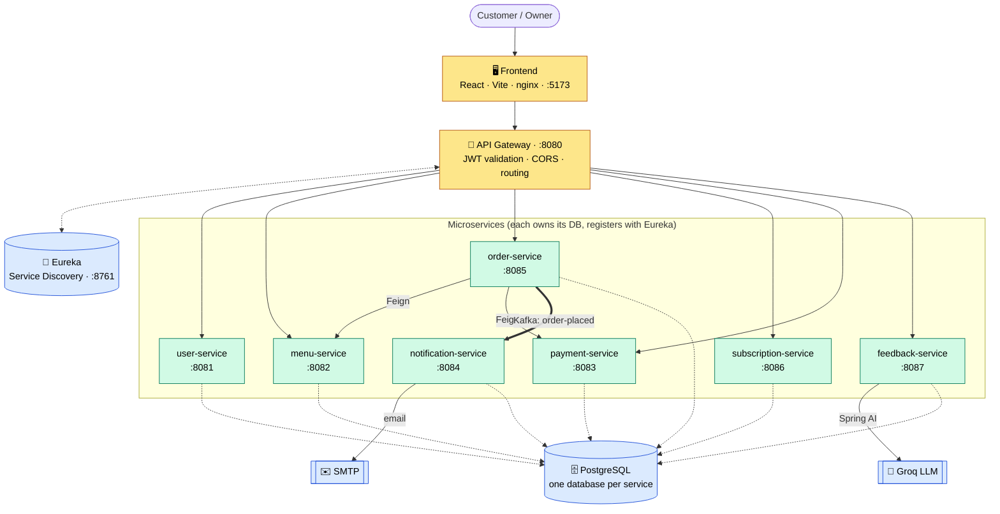

# 🍱 TiffinBox

**A production-style Spring Boot microservices platform that digitizes a real
WhatsApp-based tiffin (home-cooked meal) business.**

Browse the daily menu, order, subscribe for recurring delivery, and leave feedback that an
LLM analyzes for sentiment — served by eight independently deployable services behind an
API gateway, runnable with a single `docker compose up`.


---

## Architecture



JWT is verified **once, at the gateway**, which forwards identity to services as
`X-User-Id` / `X-User-Role` / `X-User-Email` headers. Services find each other by name
through Eureka (`lb://ORDER-SERVICE`) — never by hardcoded URL.

---

## Why it's built this way

The interesting part of a microservices project isn't the feature list — it's the
trade-offs. These are the deliberate ones:

- **JWT validated only at the gateway.** One trust boundary. The edge verifies the token
  once; internal services never re-parse JWTs — fewer places to get auth wrong.
- **Database per service, no cross-service joins.** Each service owns its data and exposes
  it only through its API, so services stay independently deployable.
- **Denormalize instead of join across boundaries.** `order_items` stores the item name
  and price *at order time* — an order stays a faithful record even when the menu changes,
  and order-service never reaches into menu-service's database.
- **No distributed transactions across remote calls.** Menu validation and payment happen
  *outside* the DB transaction; persistence lives in dedicated beans to dodge the
  `@Transactional` self-invocation proxy trap. Designed for partial failure, not
  pretend-atomicity.
- **Circuit breakers with fallbacks (Resilience4j).** Menu down → order fails fast (503)
  instead of hanging. Payment down → order is still recorded with a null payment, not lost.
- **Kafka for exactly one flow** (`order-placed` → notification), done properly rather than
  sprinkled everywhere. Placing an order shouldn't block on sending an email.
- **Admins are provisioned, not self-registered.** Public signup always yields a
  `CUSTOMER`; the owner is seeded from env vars on first boot — no privilege escalation
  through the register endpoint.
- **AI that survives a free deployment.** Sentiment analysis uses Groq's free,
  OpenAI-compatible API (not a local Ollama), so it actually works on a free cloud VM —
  and degrades to a keyword fallback when disabled.

---

## Services

| Service | Port | Database | Responsibility |
|---|---|---|---|
| **eureka-server** | 8761 | — | Service registry / discovery dashboard |
| **api-gateway** | 8080 | — | Single entry point: JWT validation, CORS, path routing |
| **user-service** | 8081 | `userdb` | Register/login, BCrypt, JWT issuance, addresses, owner seeding |
| **menu-service** | 8082 | `menudb` | Daily menus & items, owner CRUD, cutoff/close, internal validation API |
| **payment-service** | 8083 | `paymentdb` | Mock payment lifecycle (called by order-service) |
| **notification-service** | 8084 | `notifdb` | Consumes `order-placed` from Kafka → sends email |
| **order-service** | 8085 | `orderdb` | Order orchestration (Feign → menu + payment), Kafka producer |
| **subscription-service** | 8086 | `subscriptiondb` | Recurring subscriptions; scheduled auto-ordering |
| **feedback-service** | 8087 | `feedbackdb` | Order feedback + **AI sentiment analysis** (Spring AI / Groq) |
| **frontend** | 5173 | — | React storefront + owner dashboard |

---

## Tech stack

**Backend** — Java 21 · Spring Boot 3.5 · Spring Cloud 2025.0 · Eureka · Spring Cloud
Gateway (WebFlux) · OpenFeign + LoadBalancer · Resilience4j · Spring Data JPA / Hibernate ·
Apache Kafka (KRaft) · jjwt · Spring AI (Groq `llama-3.3-70b-versatile`)
**Data** — PostgreSQL (one DB per service)
**Frontend** — React 18 · Vite · Tailwind CSS · Axios · React Router
**Ops** — Maven (`mvnw`, project-per-service) · Docker multi-stage builds · docker-compose ·
GitHub Actions (matrix CI)

---

## Features

| Customer | Owner / kitchen | AI |
|---|---|---|
| Register / log in (JWT) | Pre-provisioned owner (no self-signup) | LLM analyzes each comment |
| Browse menu, cart, order | Create / edit menus, open & close ordering | → sentiment (pos/neutral/neg) |
| Order history & status | Update order status, view payments | → themes (e.g. *delivery time*) |
| Subscriptions (pause/resume/cancel) | Manage subscriptions | → one-line summary |
| Feedback with AI insights | Feedback dashboard: sentiment + top themes | Structured output via Spring AI |

---

## Run it locally

**Prerequisite:** Docker + Compose plugin (the only requirement for the full stack).

```bash
git clone https://github.com/NirbhaySharma504/TiffinBox.git
cd TiffinBox
cp .env.example .env          # set JWT_SECRET, OWNER_*, GROQ_API_KEY, …
docker compose up -d --build  # 9 services + frontend + Postgres + Kafka
```

| What | URL |
|---|---|
| App | http://localhost:5173 |
| Eureka dashboard | http://localhost:8761 |
| API gateway | http://localhost:8080 |

The owner logs in with the `OWNER_EMAIL` / `OWNER_PASSWORD` from `.env`. Grab a free Groq
key at [console.groq.com](https://console.groq.com) for the AI feature, or set
`FEEDBACK_AI_ENABLED=false` to use the keyword fallback.

```bash
docker compose ps              # status
docker compose logs -f <svc>   # tail a service
docker compose down            # stop (data volumes persist)
```

---

## API overview

All traffic goes through the gateway (`:8080`); authenticated routes need
`Authorization: Bearer <token>`.

| Method | Path | Auth | Description |
|---|---|---|---|
| POST | `/api/auth/register` | public | Register a customer |
| POST | `/api/auth/login` | public | Log in → JWT |
| GET | `/api/menu/today` | public | Current open menu |
| POST · PUT | `/api/menu/owner` · `/owner/{id}` | owner | Create / edit a menu |
| POST · GET | `/api/orders` | customer | Place / list orders |
| POST | `/api/subscriptions` | customer | Create a subscription |
| POST · GET | `/api/feedback` · `/me` | customer | Submit / view feedback (triggers AI) |
| GET | `/api/feedback/owner/summary` | owner | Sentiment summary + top themes |

*Representative subset — see each service's controllers for the full surface.*

---

## CI/CD

[`.github/workflows/ci.yml`](.github/workflows/ci.yml) builds and tests every service in
parallel via a matrix (plus the frontend). The backend job spins up a **Postgres service
container** so each Spring context test boots against a real database. Every push to `main`
and every PR is gated.

---

## Deployment

The full stack runs on a single VM via `docker compose`. A complete step-by-step guide for
the **Oracle Cloud always-free ARM tier** — firewalls, Docker install, env config, smoke
tests, and the HTTPS/reverse-proxy upgrade path — is in [`docs/DEPLOY.md`](docs/DEPLOY.md).
The stack is fully parameterized: only `VITE_API_URL` and `CORS_ALLOWED_ORIGINS` differ
between localhost and a server, both read from `.env`.

---

## Project structure

```
TiffinBox/
├── eureka-server/          # service discovery
├── api-gateway/            # edge: JWT, CORS, routing
├── user-service/           # auth, users, JWT issuance
├── menu-service/           # menus & items
├── payment-service/        # mock payments
├── notification-service/   # Kafka consumer → email
├── order-service/          # order orchestration (Feign + Kafka producer)
├── subscription-service/   # recurring orders (scheduled)
├── feedback-service/       # AI sentiment (Spring AI / Groq)
├── frontend/               # React + Vite + Tailwind
├── scripts/init-dbs.sql    # one database per service
├── docker-compose.yml      # full stack
├── .github/workflows/ci.yml
└── docs/                   # build plan, roadmap, deployment guide
```

---

## Roadmap

- [x] Service discovery, gateway, edge auth
- [x] Core domain: users, menu, orders, payments, subscriptions
- [x] Async notifications via Kafka
- [x] Resilience4j circuit breakers
- [x] AI feedback sentiment analysis (Spring AI / Groq)
- [x] Dockerized full stack + GitHub Actions CI
- [ ] Live deployment (Oracle Cloud ARM) + custom domain & HTTPS
- [ ] Natural-language menu search (Spring AI)
- [ ] Observability (metrics, tracing)

---

*Built as an in-depth study of microservice patterns — discovery, edge security,
resilience, async messaging, and AI integration — modeled on a real food business.*
